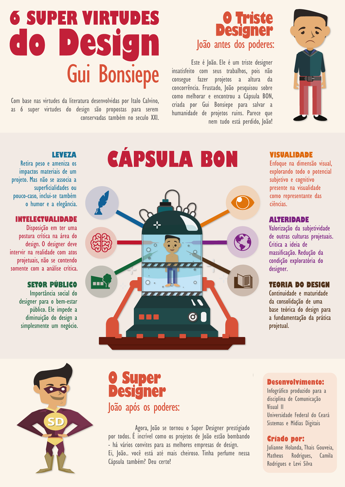

# Cápsula Bon

Infográfico interativo, desenvolvido no curso Sistemas e Mídias Digitais, da Universidade Federal do Ceará - UFC, na disciplina Comunicação Visual II (2017), ministrada pelo professor mestre Andrei Bosco.

## Informações 

Interatividade desenvolvida com a biblioteca [EaselJS](https://www.createjs.com/easeljs).

## License
[MIT](https://choosealicense.com/licenses/mit/)